# DevOps Devsu Assessment

[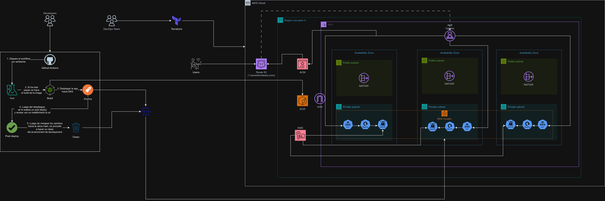](assets/images/devsu-test.drawio.png)

Este repositorio contiene una aplicación de ejemplo diseñada para evaluar habilidades en DevOps. La aplicación misma está estructurada en dos directorios principales:

- **application/**: Contiene el código fuente de la aplicación.
- **iac/**: Incluye la infraestructura como código para desplegar la aplicación.
- **assets/**: Incluye los assets para las imagenes generadas para este readme.

## Infraestructura como código:
Se centralizó el state de terraform en un bucket S3 y se utilizó una DynamoDB table para bloquear el state en caso de intentos de provisionamiento simultaneo.
El proyecto Terraform está estructurado usando módulos, los cuales detallo a continuación:

## Requisitos Previos

- [Docker](https://www.docker.com/): Para construir y ejecutar contenedores.
- [Terraform](https://www.terraform.io/): Para gestionar la infraestructura.
- [AWS CLI](https://aws.amazon.com/cli/): Para interactuar con los servicios de AWS.
- [kubectl](https://kubernetes.io/docs/tasks/tools/): Para gestionar clústeres de Kubernetes.
- [helm](https://helm.sh): Para gestionar despliegues de aplicaciones de Kubernetes.

## Configuración Inicial

1. **Clonar el repositorio**:

   ```bash
   git clone https://github.com/EsmerlinJM/devsu-demo-devops-test.git
   cd devsu-demo-devops-test

2. **Configurar AWS CLI**:

    ```bash
    aws configure --profile <perfil-aws>

3. **Desplegar infraestructura con terraform**:
    ```bash
    export KUBE_CONFIG_PATH=~/.kube/config 
    terraform init
    terraform plan -var-file=dev.tfvars”
    terraform apply -var-file=dev.tfvars”

3. **Desplegar infraestructura applicacion con helm**:
    ```bash
    eksctl utils write-kubeconfig --cluster=<cluster-name>
    
    cd application

    helm upgrade --install <nombre del deployment> ./helmchart \
    --namespace <nombre del namespace> \
    --create-namespace \
    --set image.repository="222222222.dkr.ecr.us-east-1.amazonaws.com/<tu-repo>" \
    --set image.tag="latest" \
    --set configMap.data.environment="development" \
    --set service.type="NodePort" \
    --set secret.data.database_name="base64name" \
    --set secret.data.database_user="base64user" \
    --set secret.data.database_password="base64password" \
    --set ingress.enabled=true \
    --set ingress.annotations."alb\.ingress\.kubernetes\.io/load-balancer-name"="lb-name"
    --set ingress.annotations."alb\.ingress\.kubernetes\.io/certificate-arn"="arn:aws:acm:us-east-1:2222222222:certificate/932e95c7-2295-414f-9d56-f763c2fc876a" \
    --set ingress.tls[0].hosts[0]="tuhost.com" \
    --set ingress.tls[0].secretName="sample-app-tls" \
    --set probes.enabled=true


## CODECOV
Se utilizó Codecov como herramienta de integración continua para la gestión de la cobertura de código, proporcionando un análisis detallado y un informe visual de la calidad del código en cada ejecución.

## CICD
Se utilizó Github Actions como ambiente para el CICD, de los cuales se utilizaron reusable workflows para crear pipelines genericos y puedan estos ser reutilizados en 
un futuro por algun nuevo ambiente que se quiera crear.

## Pipeline
El pipeline corre los siguientes stages, los cuales build-and-push, deploy y post-deploy son workflows reutilizables:

[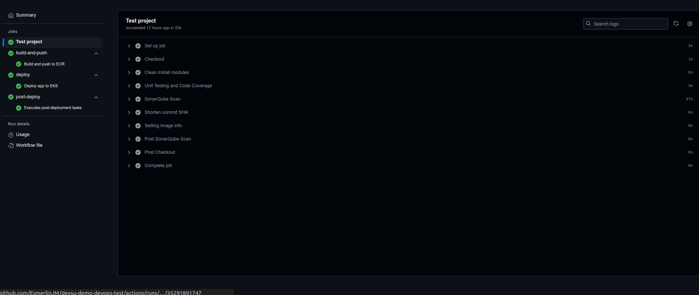](assets/images/pipeline.png)

1. Unit testing code coverage: Se corren los test y se prepara el coverage para code cov.

[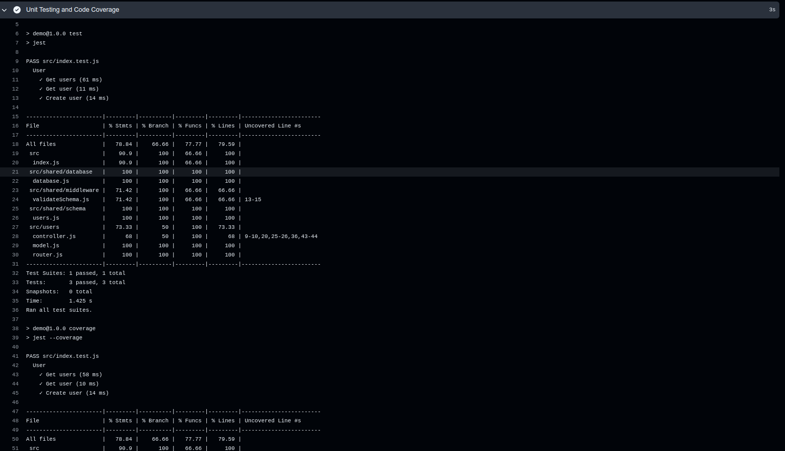](assets/images/testing.png)

2. Upload coverage reports to Codecov: Se sube el reporte hacia Codecov, en el resultado se recomienda testear y revisar las lineas de codigos que no se han testeado.

[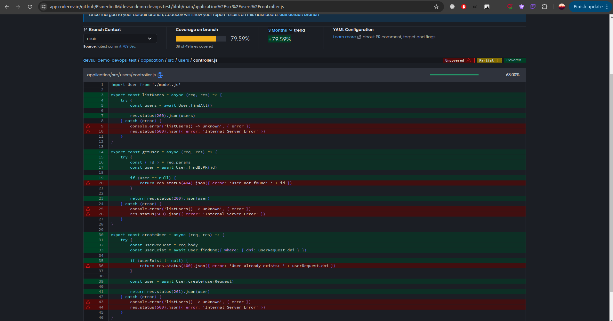](assets/images/codecov.png)

3. Build, tag and Push to ECR:  Se crea la imagen en base al Dockerfile, se coloca un tag a la imagen y se realiza un push hacia ECR.

[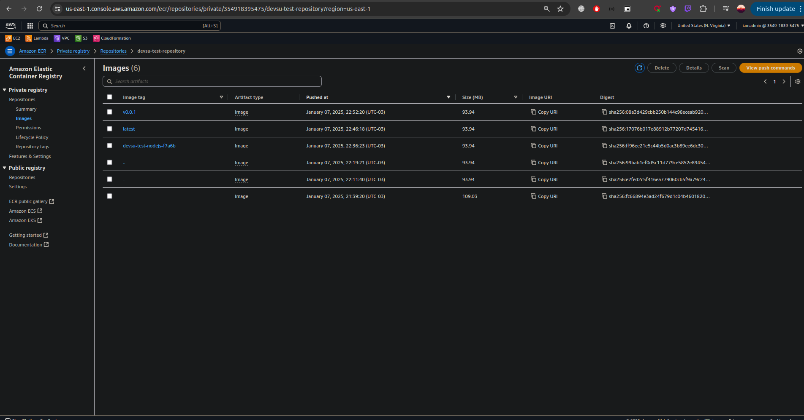](assets/images/repository-images.png)

4. Scan image with Trivy: Se escanea la imnagen con trivy.
5. Upload Trivy scan results to Github Security Lab: Se sube los resultados del escaneo.

[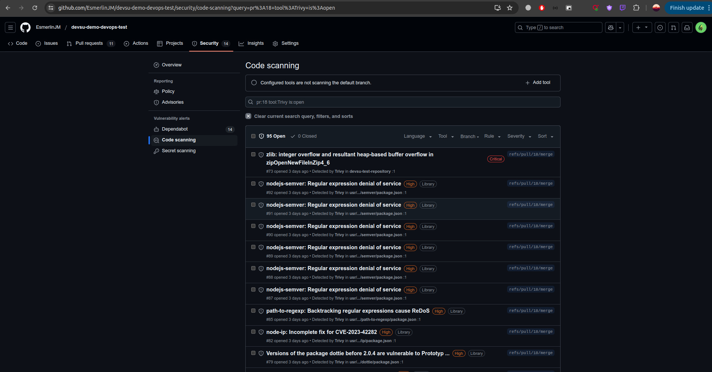](assets/images/scan-image.png)

6. Deploy app to EKS: Se despliega el helmchart hacia EKS
7. Post deploy tasks: Se ejectura un healthcheck hacia la aplicacion y se comenta en el PR siempre y cuando el environment sea development o staging
[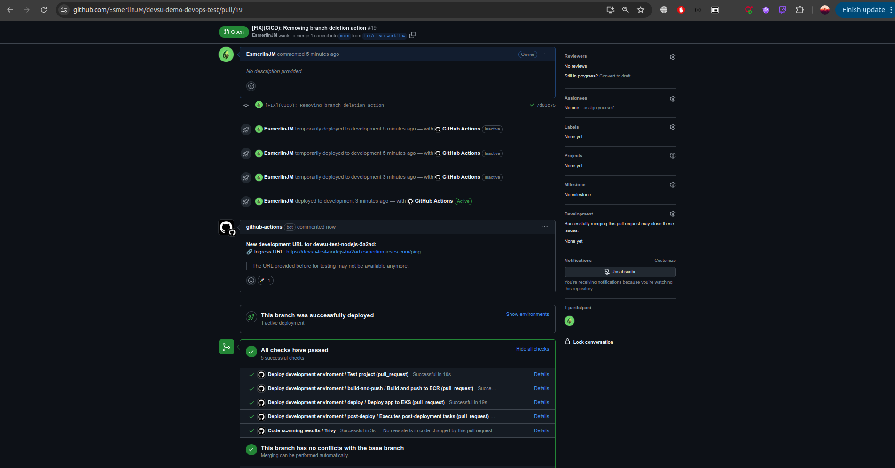](assets/images/deploy.png)
[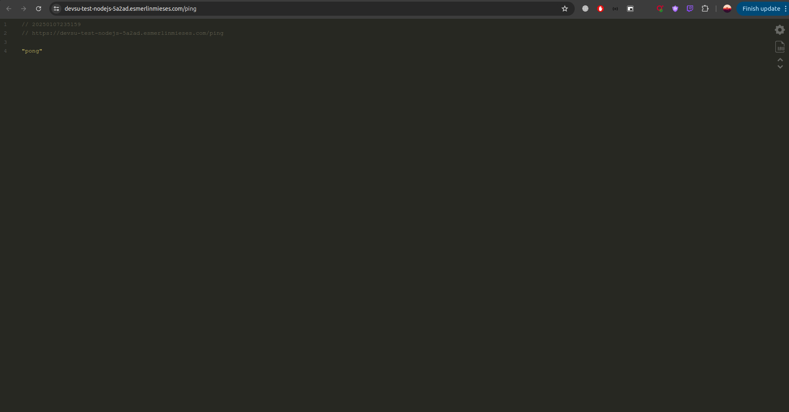](assets/images/deploy-url.png)

## HELM CHARTS
Se utilizó helm charts para realizar el despliegue de la aplicación en ambiente de desarrollo, staging y producción usando namespaces ya que es fácil de mantener en el tiempo y óptimo para actualizar nuevos cambios.

## INGRESS
Los ingress se crean automaticamente por ambiente y sirve como punto de entrada a el cluster EKS, de esta manera se puede redireccionar basado en reglas de enrutamiento a los services.

[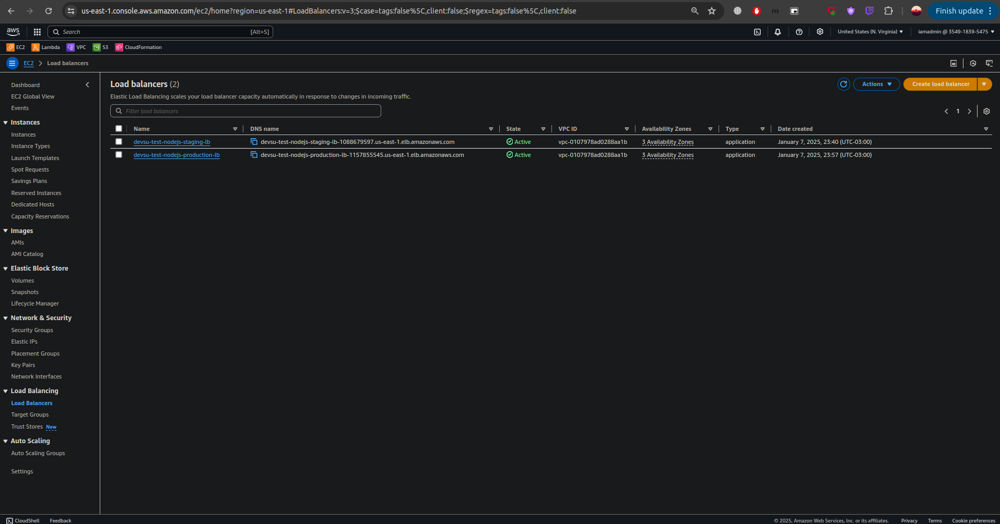](assets/images/loadbalancers.png)

## Subdminios y certificado SSL
Generé un certificado SSL con AWS ACM via terraform para garantizar que las comunicaciones esten encriptadas. Los registros CNAME se crean automaticamente por medio de external-dns a traves de una annotacion del ingress y estos apuntan a los Ingress de cada ambiente.
[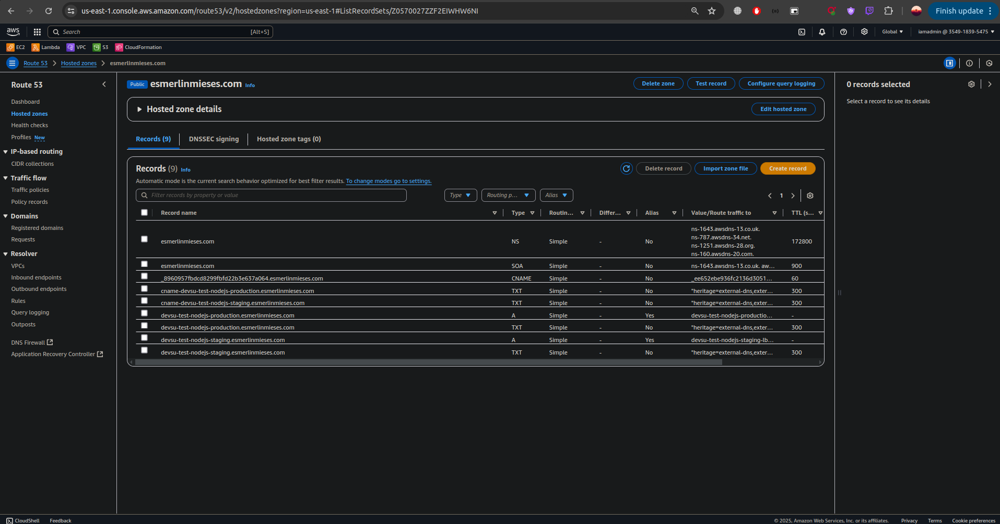](assets/images/domain-hosted-zone.png)


### SSL
[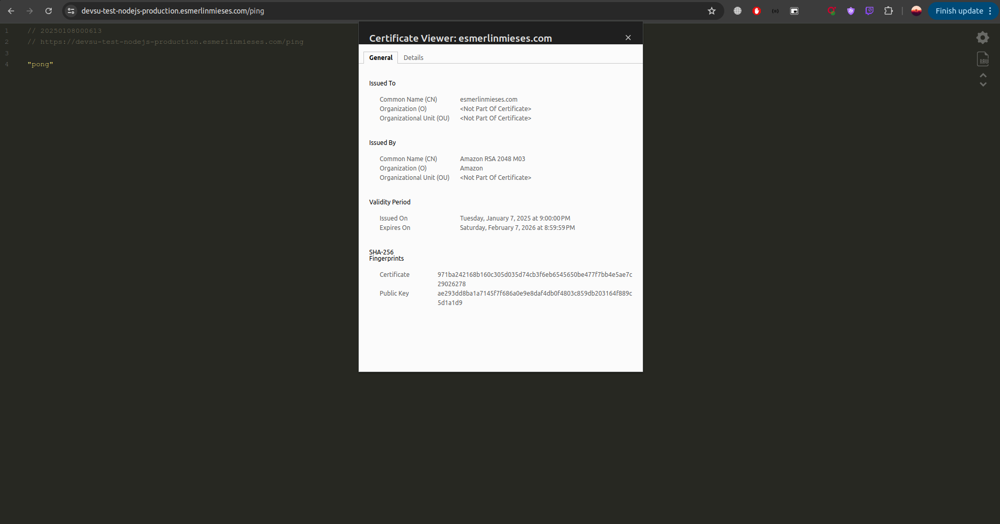](assets/images/certificate-ssl.png)

staging:
devsu-test-nodej-staging.esmerlinmieses.com

Producción:
devsu-test-nodejs-production.esmerlinmieses.com


## Pruebas

### Crear usuario mediante método POST
[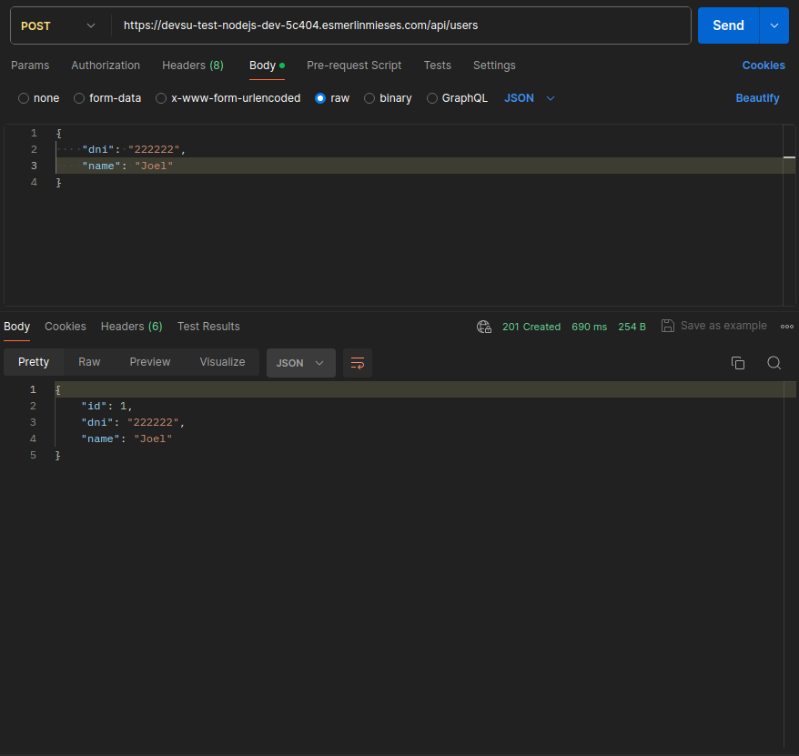](assets/images/create-user.png)

### Consultar usuarios creados mediante método GET
[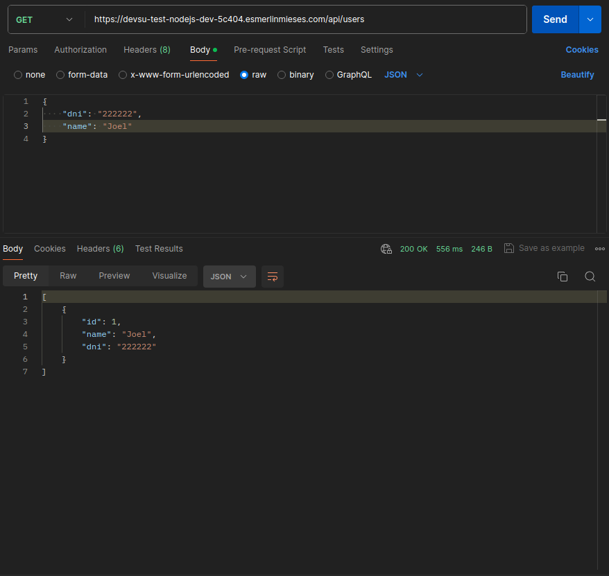](assets/images/get-users.png)


### Opciones para mejorar
1. Para bajar los costos de la infraestructura, se podrían utilizar node groups mixtos con instancias spots, on demand y reserved o utilizar groups nodes fargate haciendo un cálculo con métricas donde el tráfico de la aplicación sea bajo.

2. Migrar la base de datos hacia algún proveedor con HA, DR, Backup, etc como RDS o Aurora. Esto ofrecería alta disponibilidad, soporte a conexiones concurrentes como RDS Proxy, seguridad avanzada con secrets o credenciales que puedan rotar utilizando AWS Secrets Manager por ejemplo y una mejora en rendimiento a la aplicación.

3. Recolectar los logs y monitoreo de la aplicación, además de utilizar métricas más exactas para el monitor de la misma. Se podría utilizar algún stack como LOKI con Prometheus y Grafana o Cloudwatch agents para EKS por ejemplo.

4. Autenticar el proceso de CI/CD y/o accesos mediante STS(Security Token Service) de AWS, permitiria una integracion temporal segura entre ambos servicios, ademas de facilitar el acceso a los recursos de AWS sin la necesidad de exponer credenciales permanentes como access keys.